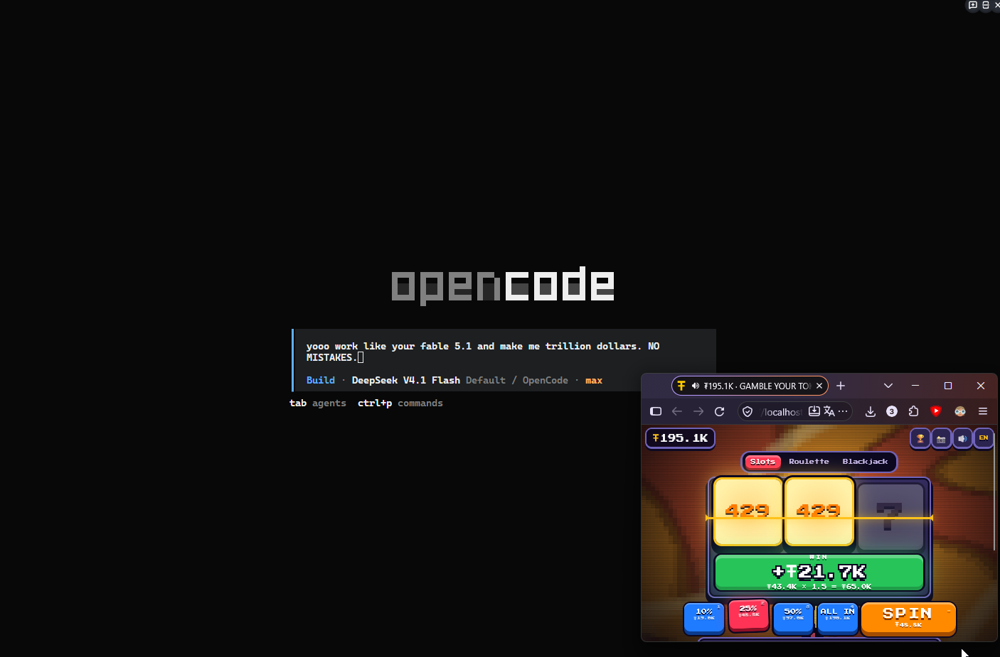

<h1 align="center">gamble your tokens</h1>

<p align="center"><a href="README.ru.md">[🇷🇺 →]</a> · <a href="README.zh.md">[🇨🇳 →]</a> </p>

<p align="center"></p>

---

<h2 align="center">what's this about?</h2>

you worked hard today, spent couple of millions of tokens - now gamble on 'em!  
 every token your AI agents burned today becomes a chip, 1:1 - and you can lose them all on slots, roulette and blackjack.

counts tokens from:

- claude code
- codex
- opencode

whatever is installed gets picked up. logs are read locally, nothing leaves your machine.

<h2 align="center">what's the point?</h2>

imagine - your agents starts to rewrite all backend on rust which will take you 3 hours. you need to fill in the void. you need... to gamble your tokens! ~and fry your dophamine receptors lmao~

just play fun casino game while your agents at work or spend it all at once at the end of the day!

<h2 align="center">install</h2>

claude code
```bash
claude plugin marketplace add szarkans/gamble-your-tokens
claude plugin install gamble@gamble-your-tokens
```

codex
```bash
codex plugin marketplace add szarkans/gamble-your-tokens
codex plugin add gamble@gamble-your-tokens
```

<h3 align="center">other hosts</h3>

just ask your agent lmao:

```
Fetch and follow instructions from https://raw.githubusercontent.com/szarkans/gamble-your-tokens/main/INSTALL.md
```

requirements: `python3`. no pip installs, no node, no dependencies. works on linux, macos, windows and wsl.

<h2 align="center">play</h2>

`/gamble` in claude code, `$gamble:gamble` in codex, or just tell your agent "let's gamble". a tab opens at `http://localhost:8777/`. close the tab and the server shuts itself down a few minutes later.

the window can be tiny - keep it next to your agent, the table and the spin button always fit.

<p align="center"></p>

<h2 align="center">knobs</h2>

| variable               | default | what it does                                     |
| ---------------------- | ------- | ------------------------------------------------ |
| `TOKEN_GAMBLE_PORT`    | `8777`  | port of the local server                         |
| `TOKEN_GAMBLE_IDLE`    | `300`   | seconds without the tab before the server exits  |
| `TOKEN_GAMBLE_NO_OPEN` |         | `1` = start the server, don't open a browser     |

your agents' own `CLAUDE_CONFIG_DIR`, `CODEX_HOME` and `XDG_DATA_HOME` are respected. history of your days lives in `~/.local/share/token-gamble/history.json`.

<h2 align="center">license</h2>

MIT. the pixel font is Press Start 2P under the SIL Open Font License, see [`licenses/`](licenses/).

<h2 align="center">gambling is bad, m'kay</h2>

real gambling ruins lives. better do it with this plugin - house always wins here too.
