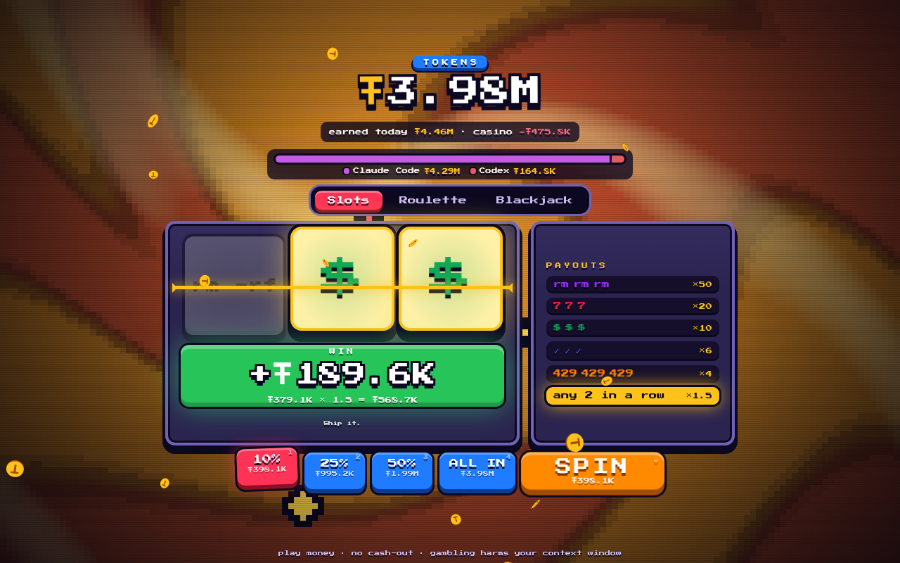

<h1 align="center">gamble your tokens</h1>

<p align="center"><a href="README.md">[🇬🇧 →]</a> · <a href="README.zh.md">[🇨🇳 →]</a> </p>

<p align="center"></p>

---

<h2 align="center">что это?</h2>

шуточное казино для вайбкодеров. каждый токен, который твои AI-агенты сожгли сегодня, становится фишкой 1:1 - и их можно спустить в слоты, рулетку и очко.

считает токены из:

- claude code
- codex
- opencode

что установлено, то и подхватит. логи читаются локально, с компа ничего не уходит.

<h2 align="center">а смысл?</h2>

никакого. ты сегодня потратил 40 миллионов токенов, чтобы агент переименовал одну переменную - так пусть хоть сгорят красиво.

реальных денег нет. ничего не купить, ничего не вывести, и не будет. фишки сгорают в полночь, рекорды остаются. выигрыш звенит, трясёт стол и швыряет в тебя монетами. проигрыш... ну, ты и так знаешь, каково это.

<h2 align="center">установка</h2>

claude code
```bash
claude plugin marketplace add szarkans/gamble-your-tokens
claude plugin install gamble@gamble-your-tokens
```

codex
```bash
codex plugin marketplace add szarkans/gamble-your-tokens
codex plugin add gamble@gamble-your-tokens
```

<h3 align="center">другие харнессы</h3>

просто попроси агента:

```
Fetch and follow instructions from https://raw.githubusercontent.com/szarkans/gamble-your-tokens/main/INSTALL.md
```

нужен `python3`. без pip, без node, без зависимостей. работает на linux, macos, windows и wsl.

<h2 align="center">играть</h2>

`/gamble` в claude code, `$gamble:gamble` в codex, или просто скажи агенту «давай погемблим». откроется вкладка `http://localhost:8777/`. закроешь вкладку - сервер сам выключится через пару минут.

окно можно сделать крохотным и держать рядом с агентом - стол и кнопка «крутить» всегда влезают.

говорит по-английски, по-русски, по-испански, по-китайски, по-корейски и по-японски - берёт язык системы, переключить можно в углу.

<h2 align="center">настройки</h2>

| переменная             | по умолчанию | что делает                                       |
| ---------------------- | ------------ | ------------------------------------------------ |
| `TOKEN_GAMBLE_PORT`    | `8777`       | порт локального сервера                          |
| `TOKEN_GAMBLE_IDLE`    | `300`        | сколько секунд без вкладки до выключения сервера |
| `TOKEN_GAMBLE_NO_OPEN` |              | `1` = поднять сервер, браузер не открывать       |

`CLAUDE_CONFIG_DIR`, `CODEX_HOME` и `XDG_DATA_HOME` твоих агентов учитываются. история дней лежит в `~/.local/share/token-gamble/history.json`.

<h2 align="center">поковырять</h2>

```bash
XDG_DATA_HOME=$PWD/.scratch/data python3 app/serve.py   # тестовые спины не попадут в настоящую историю
python3 app/test_serve.py
node tools/i18n-check.mjs                               # во всех языках все строки
```

голый html + js, без сборки: `app/web/`. игры в `app/web/games/`, переводы в `app/web/lang/`. новый харнесс - одна строка в `SOURCES` в `app/count_today.py`.

<h2 align="center">лицензия</h2>

MIT. пиксельный шрифт - Press Start 2P под SIL Open Font License, см. [`licenses/`](licenses/).

<h2 align="center">лудомания - это плохо</h2>

настоящий гемблинг ломает жизни. этот ломает только контекстное окно.
